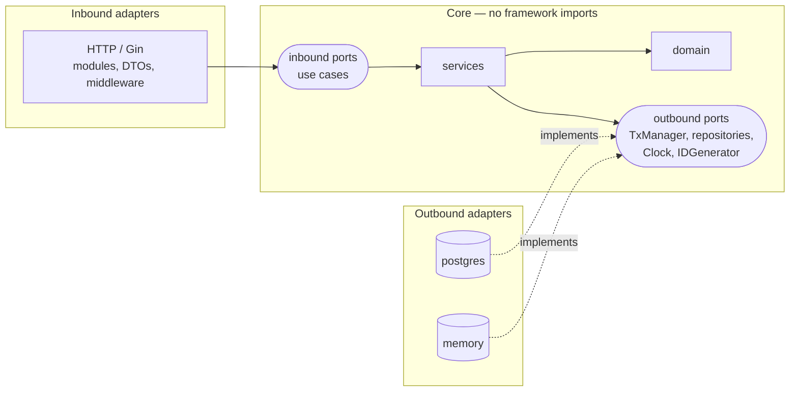

# Architecture  _(Human-owned; AI may draft, human approves)_

## 1. Context (C4 L1)

## 2. Containers & responsibilities
| Container | Responsibility | Tech | Owner |
|---|---|---|---|

## 3. Code structure — hexagonal (ADR-0002)

Dependencies always point **inward**. `cmd/api/main.go` is the only place that knows every concrete type.

## 4. Key flows
<Sequence diagrams for the 2–3 riskiest flows.>

## 5. Non-functional requirements
| NFR | Target |
|---|---|
| Availability | 99.9% |
| Latency p95 | < 300 ms |
| RPO / RTO | |
| Security | AuthN/Z, encryption in transit & at rest, audit log |

## 6. Decisions
- [ADR-0001 Record architecture decisions](adr/0001-record-architecture-decisions.md)
- [ADR-0002 Hexagonal architecture (ports & adapters)](adr/0002-hexagonal-architecture.md)

## 7. Risks & mitigations
| Risk | Impact | Mitigation |
|---|---|---|
