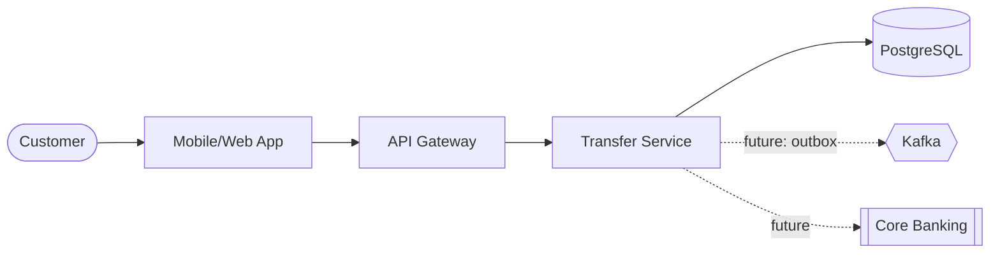
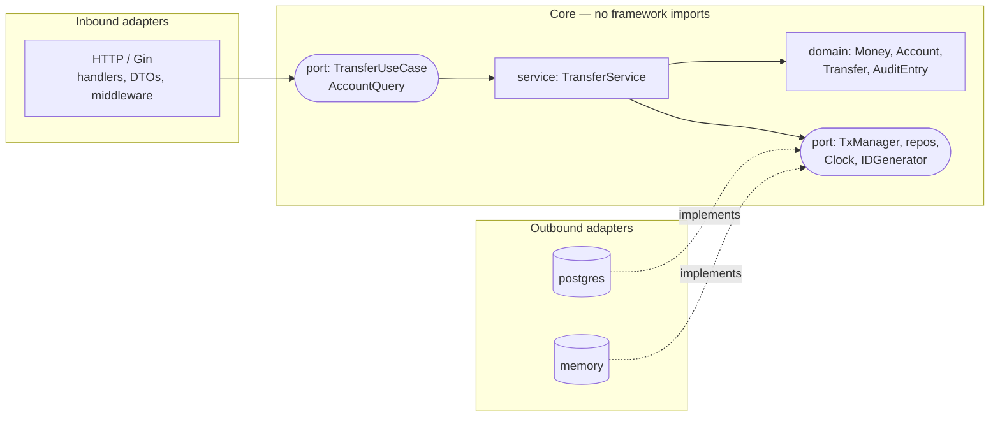
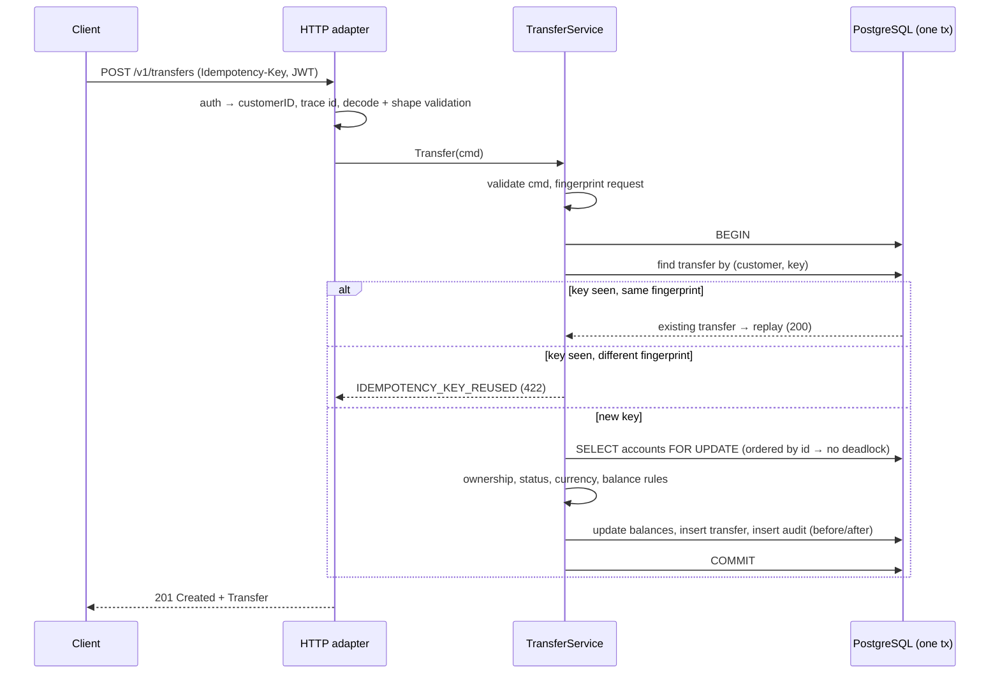

# Architecture  _(Human-owned; AI may draft, human approves)_

## 1. Context (C4 L1)

## 2. Containers & responsibilities
| Container | Responsibility | Tech | Owner |
|---|---|---|---|
| Transfer Service (`cmd/api`) | Account inquiry, intra-bank transfer, idempotency, audit | Go 1.24, Gin | Payments team |
| PostgreSQL | Accounts, transfers, audit log (single ACID store) | PostgreSQL 16 | Payments team / DBA |
| Identity Provider | Issues JWT (`sub` = customer id) | External (dev: HS256 secret) | Security |

## 3. Hexagonal layout (ADR-0002)

Dependencies always point **inward**. `cmd/api/main.go` is the only place that knows every concrete type.

## 4. Key flows
### Create transfer (idempotent)

Two concurrent requests with the same key: the loser hits the unique index `(requested_by, idempotency_key)`, the service retries once and returns the winner's transfer as a replay.

## 5. Non-functional requirements
| NFR | Target |
|---|---|
| Availability | 99.9% |
| Latency p95 | < 300 ms |
| RPO / RTO | RPO 0 (synchronous commit) / RTO 30 min |
| Security | JWT on every `/v1` route, ownership checks, deny by default, audit log, PII-free logs |

## 6. Decisions
- [ADR-0001 Record architecture decisions](adr/0001-record-architecture-decisions.md)
- [ADR-0002 Hexagonal architecture (ports & adapters)](adr/0002-hexagonal-architecture.md)

## 7. Risks & mitigations
| Risk | Impact | Mitigation |
|---|---|---|
| Double debit on client retry | Financial loss, complaints | Idempotency key + request fingerprint, unique index |
| Lost update on concurrent debits | Negative balance | `SELECT … FOR UPDATE` in id order, `CHECK (balance >= 0)` |
| Audit gap | Regulatory finding | Audit row written in the same DB transaction as the balance change |
| Events not published after commit (future Kafka) | Downstream out of sync | Transactional outbox (future ADR) |
