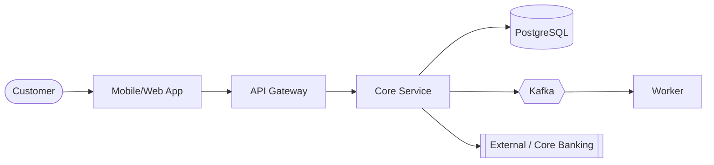
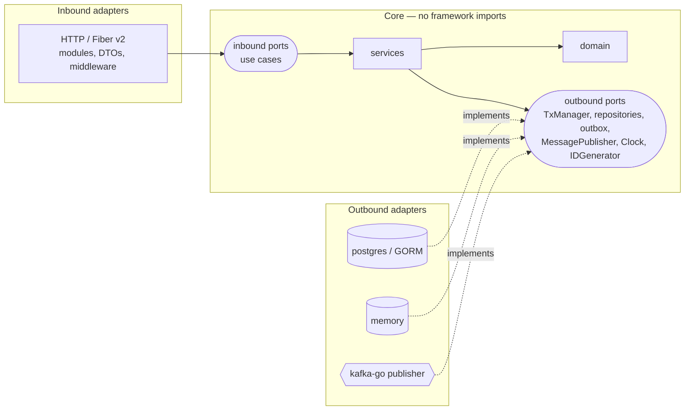

# Architecture  _(Human-owned; AI may draft, human approves)_

## 1. Context (C4 L1)

## 2. Containers & responsibilities
| Container | Responsibility | Tech | Owner |
|---|---|---|---|

## 3. Code structure — hexagonal (ADR-0002)

Dependencies always point **inward**. `cmd/api/main.go` is the only place that knows every concrete type.

## 4. Key flows
- 2C2P payment webhook (idempotent state transition): see [spec §3](../02-specs/2c2p-payment-webhook.md#3-design-notes-from-architect).
- Payment events to Kafka (transactional outbox + relay): see [spec §3](../02-specs/payment-events-outbox.md#3-design-notes-from-architect) and ADR-0004.

## 5. Non-functional requirements
| NFR | Target |
|---|---|
| Availability | 99.9% |
| Latency p95 | < 300 ms |
| RPO / RTO | |
| Security | AuthN/Z, encryption in transit & at rest, audit log |

## 6. Decisions
- [ADR-0001 Record architecture decisions](adr/0001-record-architecture-decisions.md)
- [ADR-0002 Hexagonal architecture (ports & adapters)](adr/0002-hexagonal-architecture.md)
- [ADR-0003 Fiber v2 for HTTP, GORM for PostgreSQL](adr/0003-fiber-and-gorm.md)
- [ADR-0004 Transactional outbox to Kafka with segmentio/kafka-go](adr/0004-transactional-outbox-kafka.md) _(Proposed)_
- [ADR-0005 Modular monolith: catalog, ordering, payment](adr/0005-modular-monolith-catalog-ordering-payment.md) _(Proposed)_

## 7. Risks & mitigations
| Risk | Impact | Mitigation |
|---|---|---|
