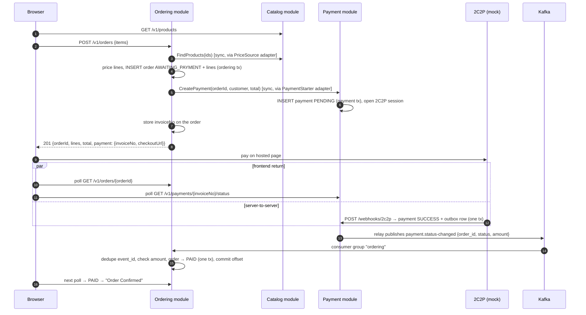

# Spec: Catalog, ordering, and payment as modules (order → payment → Kafka → order)

- **Status:** APPROVED (owner, 2026-09-29; ADR-0005 option B)
- **Owner (human):** Thapanut L.
- **Related:** ADR-0002, ADR-0004, ADR-0005, specs [payment-checkout](payment-checkout.md) (superseded in part, see §4), [payment-events-outbox](payment-events-outbox.md), [2c2p-payment-webhook](2c2p-payment-webhook.md)
- **Size:** L — delivered as five commits (§9), each green on `make verify`

## 1. Goal
Show a checkout flowing across service boundaries with real data in PostgreSQL: the browser orders from **ordering**, which prices the cart with **catalog** and asks **payment** to collect the total; 2C2P's webhook settles the payment; the payment event reaches ordering through Kafka and confirms the order. Success metric: in the demo, an order becomes PAID within 2 s of its payment becoming SUCCESS (Kafka running, default poll interval).

## 2. Scope
- In: catalog module (`catalog.products`, `GET /v1/products`); ordering module (`ordering.orders`, `ordering.order_lines`, `ordering.processed_events`, `POST /v1/orders`, `GET /v1/orders/{orderId}`); ordering's synchronous adapters to catalog and payment; ordering's consumer of `payments.v1.status-changed` (Kafka consumer group `ordering`, and in-process delivery for `STORE=memory`); payment's `CreatePayment` takes the amount from ordering; `order_id` in the payment event; depguard rules between modules; demo page switched to orders.
- **Out of scope:** separate binaries or databases; HTTP between modules; catalog administration (prices are seeded); stock/inventory; order cancellation and refunds; order events published by ordering; renaming `internal/core` to `internal/payment` (see open questions).

## 3. Design notes (from Architect)

- **Module layout.** `internal/catalog/{domain,port,service,adapter/{postgres,memory}}`, `internal/ordering/{domain,port,service,adapter/{postgres,memory,catalogclient,paymentclient,paymentevents}}`, payment stays in `internal/core` + `internal/adapter/*`. HTTP handlers for all modules stay in `internal/adapter/inbound/httpapi` (shared plumbing), one file per module.
- **Shared kernel.** `internal/kernel`: `Money` and the generic errors, standard library only (ADR-0005). Every module may import it; it imports no module.
- **Boundaries (depguard).** `internal/ordering/{domain,port,service}` import nothing from other modules. Only `internal/ordering/adapter/{catalogclient,paymentclient}` may import `internal/catalog/port` and `internal/core/port`. `internal/catalog/**` and `internal/core/**` never import `internal/ordering`. Catalog imports no other module.
- **Transactions.** Each module has its own `TxManager` over the same connection pool. Placing an order is two local transactions around the payment call (store order → start payment → store invoiceNo). No distributed transaction.
- **Order lifecycle.** `AWAITING_PAYMENT → PAID | PAYMENT_FAILED`; final states never change. Lines snapshot product name and unit price at order time, so later price changes do not alter orders.
- **Event handling.** One ordering transaction: insert `processed_events(event_id)` (conflict → duplicate, skip), load order by `order_id` with `FOR UPDATE`, check amount and currency against the order total, apply the transition. The Kafka offset is committed only after the transaction commits (at-least-once). Unknown `order_id` (e.g. payments seeded by `make webhook-demo`) and amount mismatches are recorded as processed and logged for reconciliation, so a poison message cannot block the partition.
- **Payment changes.** `CheckoutUseCase.CreatePayment(orderId, customerId, amount)`; payment loses `ProductCatalog`, `ListProducts`, and the priced lines. `POST /v1/payments` is removed from the public API: only ordering creates payments. The status endpoint, webhook, outbox, and demo events endpoint are unchanged.

## 4. Contract / schema
- Uses: `listProducts` (moves to catalog), `getPaymentStatus`, `receive2c2pPaymentNotification`, `getDemoPaymentEvents`, `publishPaymentStatusChanged`.
- **Changes (need approval with this spec):**
  - `contracts/openapi.yaml`: add `placeOrder` (`POST /v1/orders`), `getOrder` (`GET /v1/orders/{orderId}`), tag `orders`; **remove** `createPayment` (`POST /v1/payments`; unreleased). `CreatePaymentRequest`/`PaymentCheckout` schemas are replaced by `PlaceOrderRequest`/`Order`.
  - `contracts/asyncapi.yaml`: add required `order_id` to `payment.status-changed`; document consumer `ordering` (unreleased, changed in v1).
  - Migrations: `0004_catalog` (schema `catalog`, table `products`: `id text PK`, `name`, `price bigint CHECK > 0`, `currency char(3)`, `active bool`, timestamps); `0005_ordering` (schema `ordering`: `orders` (`id uuid PK`, `customer_id`, `status` CHECK, `amount bigint`, `currency`, `invoice_no text NULL UNIQUE`, timestamps), `order_lines` (`order_id` FK, `line_no`, `product_id`, `name`, `unit_price`, `quantity`, `line_total`, PK `(order_id, line_no)`), `processed_events` (`event_id uuid PK`, `processed_at`)).
  - Dev seed `migrations/dev/20_seed_catalog.sql`: the three sample products (synthetic).
  - No new env vars: the consumer runs when `KAFKA_BROKERS` is set; group id `ordering` is a constant.

## 5. Acceptance criteria
| ID | Given | When | Then |
|---|---|---|---|
| AC-01 | Products seeded in `catalog.products` (one inactive) | `GET /v1/products` | 200 with the active products and their `price`/`priceMinor`/`currency` from the database |
| AC-02 | A customer with a valid token | `POST /v1/orders {"items":[{"productId":"COFFEE-BEANS-250G","quantity":2},{"productId":"CERAMIC-MUG","quantity":1}]}` | 201: order `AWAITING_PAYMENT`, server-generated `orderId`, priced `lines`, total 1,190.00 THB, and `payment` with `invoiceNo`, `checkoutUrl`; order + lines stored in `ordering`; a PENDING payment for 1,190.00 THB with `order_id` stored in payment |
| AC-03 | A valid token | Items are empty, > 20, repeat a product, have quantity outside 1–99, or name an unknown or inactive product; or the body has unknown fields such as `amount`, `price`, or `orderId` | 400 `VALIDATION_ERROR`; no order, no payment |
| AC-04 | Payment fails to start | `POST /v1/orders` | 500 `INTERNAL_ERROR`; the order stays `AWAITING_PAYMENT` with no invoice |
| AC-05 | The customer owns order X | `GET /v1/orders/X` | 200 with status, lines, total, `invoiceNo`, `updatedAt`; another customer or unknown id → 404 `NOT_FOUND` |
| AC-06 | Order X awaits payment | `payment.status-changed` SUCCESS for X with the order total arrives | Order X is `PAID`; FAILED → `PAYMENT_FAILED` |
| AC-07 | AC-06 processed | The same event (same `event_id`) arrives again, or 20 copies arrive concurrently | Exactly one transition; one `processed_events` row |
| AC-08 | Order X is final | An event with a different outcome arrives | Order unchanged; warning logged |
| AC-09 | Order X awaits payment | The event's amount or currency differs from the order total | Order unchanged; error logged without identifiers beyond ids; event recorded as processed |
| AC-10 | No order has the event's `order_id` | The event arrives | Ignored and recorded as processed |
| AC-11 | `STORE=memory`, no Kafka | A payment becomes SUCCESS | The in-process publisher delivers the event and the order becomes `PAID` |
| AC-12 | `KAFKA_BROKERS` set | The consumer handler fails | The offset is not committed; the event is processed again later |
| AC-13 | Any | `POST /v1/payments` | 404 (route removed); payments are created only by ordering |
| AC-14 | Any | `make lint` | Fails if ordering's core imports another module, or catalog/payment import ordering |
| AC-15 | Demo enabled | Checkout, then Simulate Successful Payment | The page shows payment SUCCESS first, then order PAID and "Order Confirmed"; the debug box shows the order, payment, webhook, and Kafka hops |

## 6. Non-functional
- Performance: place order = one catalog read, one ordering insert (+ lines), one payment insert, one ordering update; p95 < 300 ms excluding the real gateway. Event handling = one ordering transaction.
- Security / PII: `/v1` routes need a bearer token; orders are owner-only; the client sends no prices; logs carry ids only.
- Audit / observability: warn/error logs for conflicting or mismatching events (reconciliation); consumer lag visible in kafka-ui (`ordering` group).
- Idempotency / consistency: `processed_events` + final-state rule; at-least-once consumption; eventual consistency between payment and order (documented in the demo).

## 7. Threats & mitigations
| Threat (STRIDE) | Likelihood | Impact | Mitigation | AC |
|---|---|---|---|---|
| T: client lowers the price | H | H | Client sends ids and quantities only; ordering prices from catalog; payment takes the amount only from ordering | AC-02, AC-03, AC-13 |
| T: forged or replayed event marks an order paid | L | H | Only the relay publishes to the topic (ACLs, ops); amount check against the order; `event_id` dedup | AC-07, AC-09 |
| I: customer reads another customer's order | M | M | Owner check; NOT_FOUND identical to unknown | AC-05 |
| D: poison event blocks the partition | M | M | Mismatch/unknown events are recorded and skipped, not retried forever | AC-09, AC-10 |
| R: disputes over what was ordered | M | M | Lines snapshot name and unit price | AC-02 |

## 8. Open questions
- [ ] Rename `internal/core` to `internal/payment` so the three modules read alike? Pure move, large diff; recommended as a separate commit after this spec.
- [ ] Should ordering retry starting a payment for an order left `AWAITING_PAYMENT` without an invoice (AC-04), or let the customer place a new order?
- [ ] Should ordering publish its own `order.confirmed` event for fulfilment?

## 9. Delivery plan (one commit each, `make verify` green after each)
1. **refactor(payment):** extract `internal/kernel`; `CreatePayment(orderId, customerId, amount)`; remove the catalog and `POST /v1/payments` from payment; `order_id` in the event. The demo page is broken from here until commit 5.
2. **feat(catalog):** module, migration `0004`, dev seed, `GET /v1/products` from PostgreSQL (memory adapter for `STORE=memory`).
3. **feat(ordering):** module, migration `0005`, `POST/GET /v1/orders`, catalog and payment client adapters, depguard rules.
4. **feat(ordering):** payment event consumer (Kafka group `ordering`; in-process for memory), idempotent handler.
5. **feat(demo):** page uses orders; debug box shows order → payment → webhook → Kafka → order.
